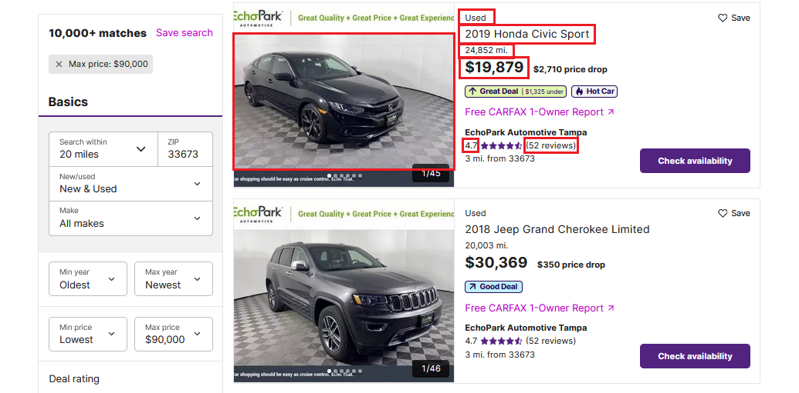

# Crawler for cars

Scrape multiple web pages in [www.cars.com](https://www.cars.com/) website with Python using BeautifulSoup and requests.
You can store your data in a file or MongoDB or both

## What is being scrapped
* Title 
* Pictures
* Year
* Stock type (New or Used)
* The mileage
* Price
* Rating
* Reviews



## Requirements

* Python 3.6+
* Works on Linux, Windows, macOS, BSD

## Installation

Use the package manager [pip](https://pip.pypa.io/en/stable/) and requirements.txt file to install requirements.

```bash
# Create a virtual environment
virtualenv -p python3 venv

# Activate virtual environment
# Linux
source venv/bin/activate
# Windows
venv\Scripts\activate

# Install dependencies
pip install -r requirements.txt
```

## Database configuration
Edit the config file in **src/config.py** and set below items.

db_name and db_collection must be defined together

Below are the defaults.
* #### db_url = 'localhost'
* #### db_port = 27017
* #### db_name = "crawl"
* #### db_collection = "crawl_collec"


## Usage

```bash
# Run script
python main.py

# Set store methods. Leave blank to use defaults
Save to MongoDB (defaults: False)[Y/N]:
Save to file (defaults: True)[Y/N]:

# Enter the minimum price in dollars
Enter the minimum price in dollars [1000]:

# Enter the maximum price in dollars
Enter the maximum price in dollars [2000]:

# Print Result
Page 1 crawled.
Saved in mongo.
Saved in file.
```

## Contributing
Pull requests are welcome. For major changes, please open an issue first to discuss what you would like to change.

Please make sure to update tests as appropriate.

## License
[MIT](https://choosealicense.com/licenses/mit/)